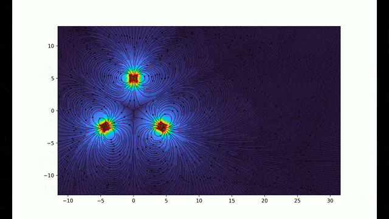
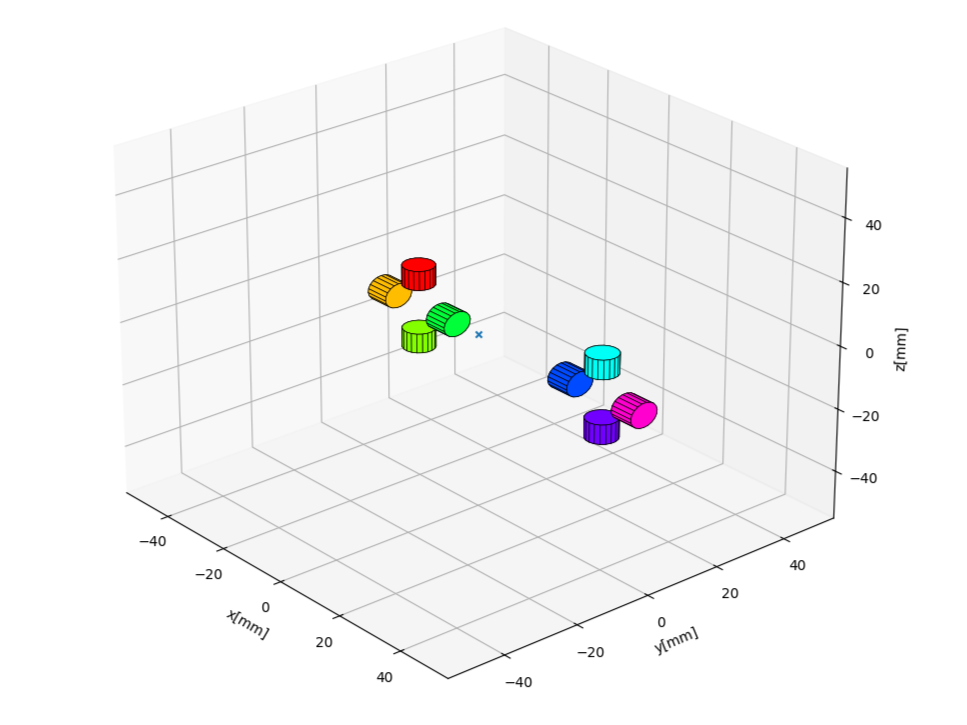

# Magnetic-Gear-simulation🐻

The script uses an open-source library <a href="https://github.com/magpylib/magpylib/tree/main">Magpylib</a>

### Script to illustrate the magnetic induction lines of a "10. Magnetic Gear" problem on the 2024 International Young Physics Tournament

  
    
  Effect of a gear with 4 magnets on a gear with different numbers of magnets
     

  
    
  Mutual arrangement of magnets in 3d
     

  
    
  Effect of a gear with 4 magnets on a gear with 4 magnets
     

  
    
  Effect of a gear with 3 magnets on a gear with 4 magnets
     

  
    
  Effect of a gear with 3 magnets on a gear with 3 magnets
     

